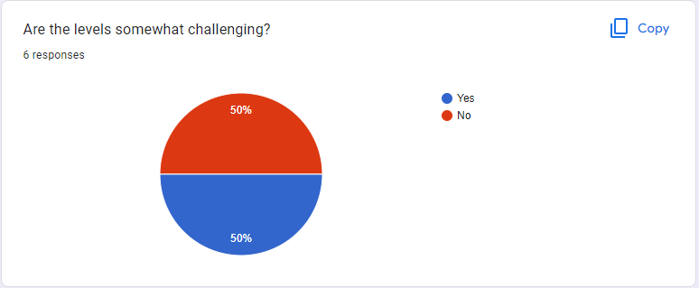

# 3.1 Testing for Function and Robustness

## Criteria To Assess

Find success criteria that relate to function and robustness

| Criterion | Description                       |
| --------- | --------------------------------- |
| 21        | Game should run without crashing. |

### Criterion 21

To test this, I started by playing my game as you would normally and experienced no crashes or game-stopping bugs. Then I started to overload the game with multiple inputs in an attempt to put the game under as much stress as possible but, due to the simplicity of my game, there wasn't much I could do to put the game under more strain - because of this despite my best efforts to crash the game all I ever experienced was a frame rate drop of 3 frames at most.&#x20;

<figure><figcaption></figcaption></figure>

###
